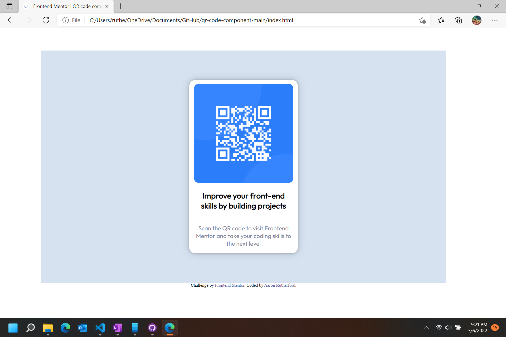

# Frontend Mentor - QR code component solution

This is a solution to the [QR code component challenge on Frontend Mentor](https://www.frontendmentor.io/challenges/qr-code-component-iux_sIO_H). Frontend Mentor challenges help you improve your coding skills by building realistic projects. 

## Table of contents

- [Overview](#overview)
  - [Screenshot](#screenshot)
  - [Links](#links)
- [My process](#my-process)
  - [Built with](#built-with)
  - [Continued development](#continued-development)
- [Author](#author)
- [Acknowledgments](#acknowledgments)

**Note: Delete this note and update the table of contents based on what sections you keep.**

## Overview

### Screenshot

### Links

- Solution URL: (https://hazipan.github.io/qr-code-component-main/)

## My process

1.) Set up and format HTML in prep of styling
2.) Style from the outside, in.
  - Start with root to declare custom variables
  - Move on to the body for global styles
  - Style containers
  - Style conatiner content

### Built with

- CSS custom variables
- Flexbox
- Responsive design without media queries

### Continued development

I need to continue working on projects so that I can be comfortable with HTML and CSS to the point where I don't need to constantly be referencing notes.

## Author

- GitHub - [Hazipan](https://github.com/Hazipan)
- Frontend Mentor - [Hazipan](https://www.frontendmentor.io/profile/Hazipan)

## Acknowledgments

Thanks to freecodecamp.org for teaching me everything I know!